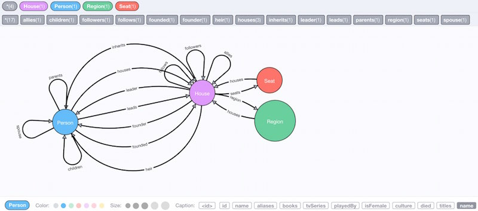
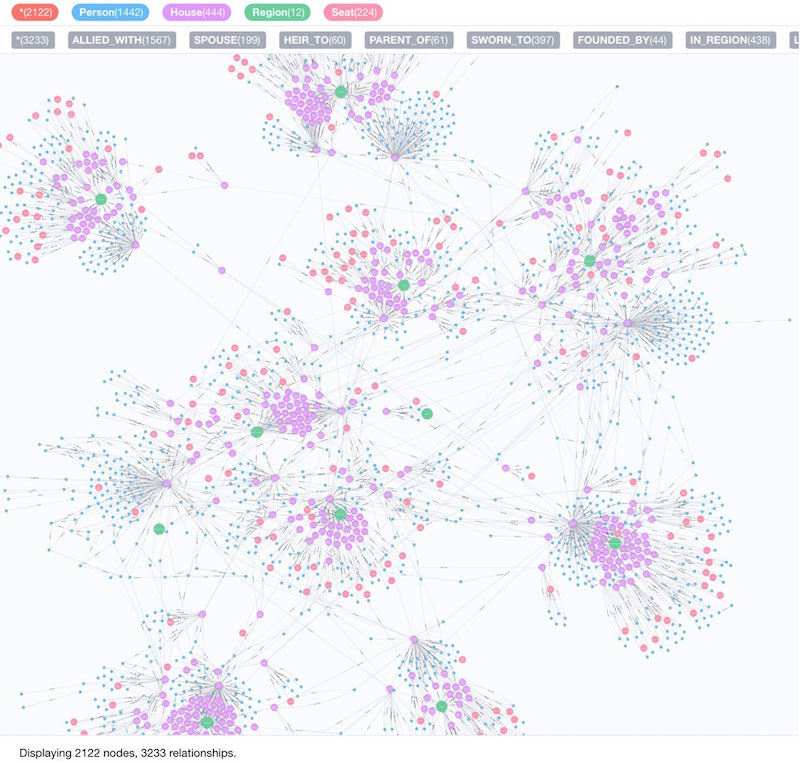
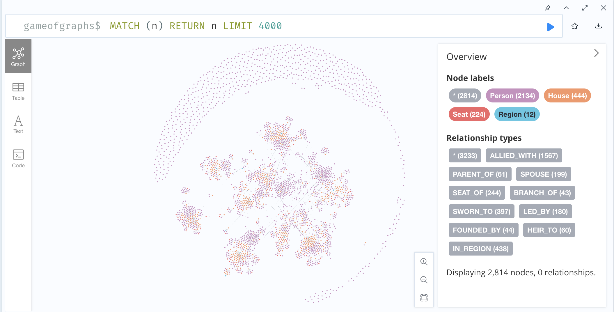
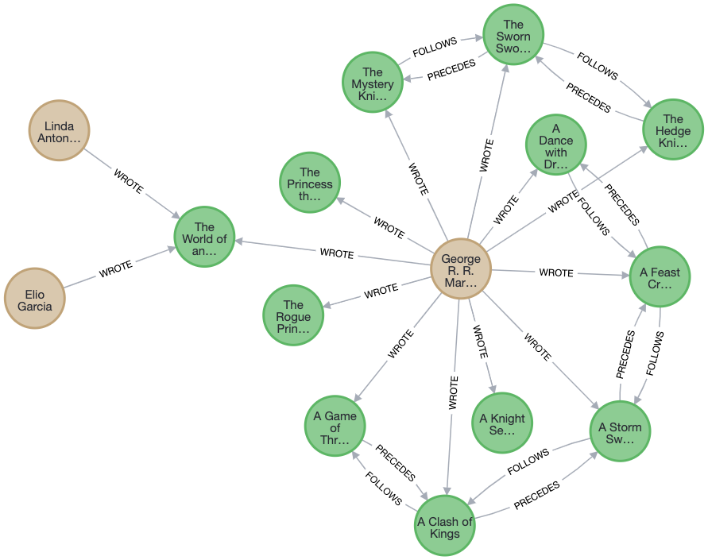
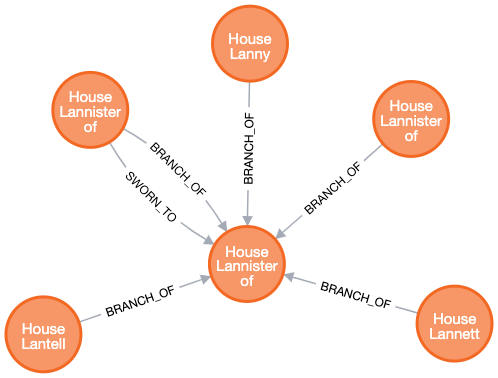
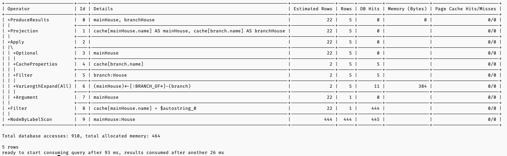
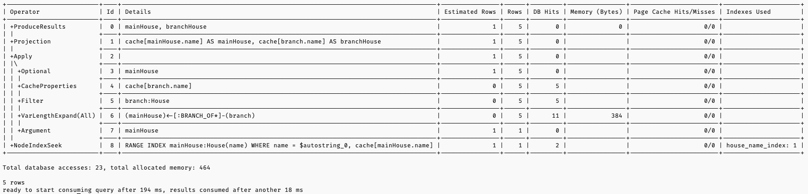



# Zbiór danych

Wybrałem zbiór danych _Game of Graphs_ @github:game-of-graphs zawierający informacje o postaciach, rodach, rejonach i siedzibach rodów z serii książek Pieśń Lodu i Ognia (Gra o Tron) autorstwa George’a R.R. Martina @martin:game-of-thrones @martin:clash-of-kings @martin:storm-of-swords @martin:feast-for-crows @martin:dance-with-dragons.
Zdecydowałem się na ten zbiór, ponieważ jestem fanem fantastyki. Sądzę, że ciekawe będzie przeanalizowanie go.

Zbiór _Game of Graphs_ @github:game-of-graphs został przygotowany na podstawie danych z projektu An API of Ice And Fire @github:an-api-of-ice-and-fire.
W zbiorze bzowo występują 4 rodzaje węzłów oraz 17 rodzajów relacji widocznych na @fig-base-gog-schema.
Bazowy zbiór zawiera 2122 węzłów i 3233 relacji widocznych na podglądzie @fig-base-gog-data.

{#fig-base-gog-schema}

{#fig-base-gog-data}

Ponieważ bazowy zbiór _Game of Graphs_ @github:game-of-graphs zawiera tylko 4 rodzaje węzłów, dodam do niego typ węzła `Book` reprezentujący książki z serii.
Projekt _An API of Ice And Fire_ @github:an-api-of-ice-and-fire dostarcza endpoint pozwalający na pobranie informacji o książkach.
Nie został on jednak wykorzystany w bazowym zbiorze _Game of Graphs_ @github:game-of-graphs.

# Instalacja Neo4j i wczytanie danych

Przygotowanie bazy danych i wczytanie wstępnych danych.

## Instalacja

Wybrałem wersję Neo4j _Community Edition_, ponieważ jest ona darmowa @neo4j:editions. Nie potrzebuję funkcji dostępnych w wersji _Enterprise Edition_ @neo4j:editions.

Zdecydowałem się na użycie Docker'a, w celu zapewnienia replikowalności mojego środowiska.
Skonfigurowałem Neo4j jako kontener Docker w pliku [`docker-compose.yml`](https://github.com/christopher-dabrowski/BoardBase/blob/main/docker-compose.yml) , bazując na instrukcjach z dokumentacji Neo4j @neo4j:docker-getting-started @neo4j:docker-persisting-volumes.

Żeby skonfigurować Neo4j zdecydowałem się na pobranie domyślnych plików konfiguracyjnych, modyfikację ich i podmontowanie do kontenera. \
Bazową konfigurację pobrałem poleceniem `docker run --rm --volume=./neo4j/conf:/conf neo4j:2025.11.2 dump-config` bazując na dokumentacji @neo4j:docker-configuration.
Zwiększyłem dostępną pamięć i wyłączyłem telemetrię dostosowując plik [`neo4j.conf`](https://github.com/christopher-dabrowski/BoardBase/blob/main/neo4j/conf/neo4j.conf).

Przeczytałem, że domyślnie format pliku konfiguracyjnego to _ISO-8859-1_, co może powodować problemy, gdybym używał polskich znaków. Próbowałem zmienić go na _UTF-8_ ustawiając zmienną środowiskową @neo4j:neo4j-conf. \
Jednak po uruchomieniu kontenera Neo4j wyświetlał błąd konfiguracji, więc zrezygnowałem z tego ustawienia.

Do wybrania wartości ustawień dostępnej pamięci uzyłem narzędzia `bin/neo4j-admin server memory-recommendation` @neo4j:memory-recommendations w kontenerze podając dostępną pamięć jako 4 GB.

Skonfigurowałem również automatyczną instalację pluginu _APOC Core_ oraz skonfigurowałem go w pliku [`apoc.conf`](https://github.com/christopher-dabrowski/BoardBase/blob/main/neo4j/conf/apoc.conf), zgodnie z dokumentacją @neo4j:docker-plugins @neo4j:apoc-installation @neo4j:apoc-configuration.

Po uruchomieniu kontenera sprawdziłem czy Neo4j działa poprawnie, używając `cyhper-shell` @neo4j:cypher-shell. \
Możliwe jest też użycie _Aura Console_ do podłączenia się do lokalnej instancji Neo4j @neo4j:access, mi to jednak nie działało.
Zamiast tego, żeby móc korzystać z wizualizacji uruchomiłem wbudowany interfejs webowy <http://localhost:7474/browser>. \
Skonfigurowałem również rozszerzenie edytora kodu [Neo4j for VS Code](https://marketplace.visualstudio.com/items?itemName=neo4j-extensions.neo4j-for-vscode).

## Wyczytanie danych

Próbowałem stworzyć bazę danych poleceniem Cypher @neo4j:create-databases (@lst-cypher-create-database).
Przy okazji chciałem też ustawić domyślną wersję Cypher na 25, żeby mieć dostęp do najnowszych funkcji języka. \
Otrzymałem jednak błąd.
Dopiero gdy doczytałem dokumentację zorientowałem się, że **polecenie `CREATE DATABASE` nie działa w tylko w wersji _Enterprise Edition_** @neo4j:create-databases.

```{#lst-cypher-create-database .cypher lst-cap="Nieudane utworzenie bazy w Cypher"}
CREATE DATABASE GameOfGraphs
DEFAULT LANGUAGE CYPHER 25
```

Żeby utworzyć bazę danych `GameOfGraphs` zastosowałem obejście z wątku na forum @stackoverflow:error-when-creating-new-database-under-neo4j-4, polegające na zmianie domyślnej bazy w pliku konfiguracyjnym [`neo4j.conf`](https://github.com/christopher-dabrowski/BoardBase/blob/main/neo4j/conf/neo4j.conf). \
Przy restarcie kontenera zauważyłem ostrzeżenie, że klucz konfiguracyjny `dbms.default_database` jest przestarzały i należy użyć `initial.dbms.default_database`, więc to poprawiłem. \
Przy okazji skonfigurowałem też domyślną wersję Cypher na 25, ponieważ bazowo jest to już nie rozwijany Cypher 5 @neo4j:configuration-settings:cypher-version @neo4j:select-cypher-version.

Do importu danych chciałem użyć procedury `apoc.load.json` z pluginu _APOC_.
Jednak nie działała mi ona mimo, że skonfigurowałem instalację pluginu _APOC_ za pomocą zmiennej środowiskowej `NEO4J_PLUGINS`. \
Po przyjrzeniu się problemowi zorientowałem się, że ponieważ używam _Docker Compose_ nie mogę mieć cudzysłowów `'` w okół wartości zmiennej środowiskowej `NEO4J_PLUGINS`, tak jak jest to pokazywane w dokumentacji na przykładach @neo4j:docker-plugins, ponieważ przykłady te są ze składnią dla zwykłego Docker CLI. \
Poprawiłem konfigurację w pliku [`docker-compose.yml`](https://github.com/christopher-dabrowski/BoardBase/blob/main/docker-compose.yml) i plugin _APOC_ został zainstalowany poprawnie.

Do wczytania danych chciałem użyć gotowego skryptu z repozytorium _Game of Graphs_ [`got-import.cypher`](https://github.com/neo4j-examples/game-of-thrones/blob/master/got-import.cypher) @github:game-of-graphs.
Linter z pluginu _Neo4j for VS Code_ @vscode-marketplace:neo4j-for-vscode zwrócił mi uwagę na nieaktualną składnię tworzenia indeksów i constraint, więc poprawiłem ją na zgodną z dokumentacją @neo4j:create-constraints @neo4j:syntax-indexes. \
Pliki \acr{JSON}, z których korzystał skrypt nie są już dostępne pod adresami URL w skrypcie.
Udało mi się je jednak odnaleźć na branchu `release` repozytorium _Game of Graphs_ @github:game-of-graphs.
Pobrałem je i zmodyfikowałem moją wersję skryptu [`got-import.cypher`](https://github.com/christopher-dabrowski/BoardBase/blob/main/neo4j/importData/got-import.cypher), żeby korzystała z lokalnych plików. \
Przy próbie importu występował jednak błąd `Cannot merge the following node because of null property value for 'id': (:Person {id: null})`.
Testując skrypt na mniejszym pliku, który przygotowałem, zauważyłem, że problemem jest tworzenie relacji.
Ustaliłem, że problemem jest wykonanie `CASE`, który mimo danych będących `null` wykonywał kod tworzący relację do węzła, który w tym  przypadku miał `id` równe `null`.
Udało mi się rozwiązać ten problem stosując wersję _Generic_ `CASE` zamiast _Simple_ `CASE` @neo4j:conditional-expressions-case. \
Po tej poprawce udało mi się wczytać dane do bazy.
Ich wizualizacja jest widoczna na @fig-initial-data-loaded.
Na ogolnej wizualizacji widać zgrupowania postaci w danych rodach, oraz zbiór niezależnych postaci otaczajacy środkowe grupy.

Ponieważ bazowy zbiór _Game of Graphs_ @github:game-of-graphs zawiera tylko 4 rodzaje węzłów, wczytałem też dane o książkach z serii. \
Napisałem skrypt [`import_books.cypher`](https://github.com/christopher-dabrowski/BoardBase/blob/main/neo4j/importData/import_books.cypher), który na podstawie danych z _An API of Ice And Fire_ @github:an-api-of-ice-and-fire tworzy węzły `Author` i `Book`, oraz relacje `WROTE`, `FOLLOWS` i `PRECEDES` między nimi.

Wyliczyłem liczbę węzłów i relacji prostymi zapytaniami i przedstawiłem je w tabelach @tbl-initial-node-count i @tbl-initial-rel-count.
Wizualizacja wczytanych danych jest widoczna na @fig-books-and-authors-loaded.

| typ węzła | liczba węzłów |
|----------|-------------:|
| "Person" | 2134        |
| "House"  | 444         |
| "Seat"   | 224         |
| "Region" | 12          |

: Liczba węzłów po wczytaniu danych {#tbl-initial-node-count}

| relacja | typ docelowego węzła | liczba relacji |
|------------------|----------------|------:|
| "ALLIED_WITH"   | "House"       | 1567 |
| "ALLIED_WITH"   | "Person"      | 1567 |
| "SWORN_TO"      | "House"       | 794  |
| "IN_REGION"     | "Region"      | 438  |
| "IN_REGION"     | "House"       | 438  |
| "SPOUSE"        | "Person"      | 398  |
| "SEAT_OF"       | "House"       | 244  |
| "SEAT_OF"       | "Seat"        | 244  |
| "LED_BY"        | "Person"      | 180  |
| "LED_BY"        | "House"       | 180  |
| "PARENT_OF"     | "Person"      | 122  |
| "BRANCH_OF"     | "House"       | 86   |
| "HEIR_TO"       | "House"       | 60   |
| "HEIR_TO"       | "Person"      | 60   |
| "FOUNDED_BY"    | "Person"      | 44   |
| "FOUNDED_BY"    | "House"       | 44   |

: Liczba relacji po wczytaniu danych {#tbl-initial-rel-count}

::: {#fig-loaded-data layout="[50, -5, 50]"}

{#fig-initial-data-loaded}

{#fig-books-and-authors-loaded}

Wizualizacja wczytanych danych z _Api of Ice And Fire_ @github:an-api-of-ice-and-fire
:::

# Dołączenie drugiego zbioru danych

Zdecydowałem się rozszerzyć mój zbiór danych o zbiór z informacjami o bitwach z platformy _Kaggle_ @kaggle:dataset:game-of-thrones.

## Wczytanie danych o bitwach

Napisałem skrypt [`import_battles.cypher`](https://github.com/christopher-dabrowski/BoardBase/blob/main/neo4j/importData/import_battles.cypher), który wczytuje dane z pliku CSV i tworzy węzły `Battle` oraz relacje z już istniejącymi węzłami `Person`, `House` i `Region` opisane w @tbl-battle-relations.

| Nazwa relacji | Węzeł źródłowy | Węzeł docelowy | Opis |
|---------------|----------------|----------------|------|
| `TOOK_PLACE_IN` | `Battle` | `Region` | Bitwa miała miejsce w danym regionie |
| `COMMANDED_ATTACK_IN` | `Person` | `Battle` | Osoba dowodzi atakiem w bitwie |
| `COMMANDED_DEFENSE_IN` | `Person` | `Battle` | Osoba dowodzi obroną w bitwie |
| `ATTACKED_IN` | `House` | `Battle` | Ród atakował w bitwie |
| `DEFENDED_IN` | `House` | `Battle` | Ród bronił się w bitwie |

: Relacje tworzone w skrypcie import_battles.cypher {#tbl-battle-relations}

Do wczytania pliku \acr{CSV} na początku chciałem użyć procedury `apoc.load.csv`.
Po pojawieniu się błędu o nieznalezionej procedurze zorientowałem się, że jest ona w pluginie _APOC Extended_, a nie w podstawowym _APOC Core_ @neo4j:apoc-load-csv.
W sytuacji zdecydowałem się wypróbować domyślne polecenie `LOAD CSV`, ponieważ nie potrzebowałem żadnych specjalnych opcji dostępnych w `apoc.load.csv` @neo4j:apoc-load-csv.

Pisząc skrypt zwróciłem uwagę, żeby nie tworzyć węzłów innych niż `Battle`.
Do tworzenia węzłów `Battle` użyłem `MERGE`, żeby nie tworzyć duplikatów przy ponownym uruchomieniu skryptu.
Traktowałem mój główny zbiór danych jako właściwą listę postaci, domów i rodów.
Żeby to osiągnąć użyłem `MATCH` zamiast `MERGE` przy wyszukiwaniu istniejących węzłów.
Dodałem też walidację, korzystając z `apoc.util.validatePredicate` na wypadek gdyby nazwy różniły się między zbiorami.

Dane w pliku \acr{CSV} posiadały niestandardowy format wymienienia wielu postaci.
W kolumnach `attacker_king` i `defender_king`, w przypadku uczestnictwa kilku władców, różni królowie mieli podane najpierw imiona oddzielone `/`, a potem wspólne nazwisko. Przykładowo `Joffrey/Tommen Baratheon` oznaczało udział Joffrey'a Baratheona i Tommena Baratheona.
Wymagało to dedykowanej logiki oddzielania postaci.
W pozostałych kolumnach, z wieloma wartościami wartości, były oddzielone przecinkami.

Dostosowania wymagało też powiązanie nazw domów.
W pliku \acr{CSV} nazwy domów były krótkie np. `Lannister`, natomiast w bazowych danych były one pełne, np. `House Lannister of Casterly Rock`.
Żeby powiązać te nazwy użyłem `CONTAINS`.

Ostatnim problemem, który napotkałem przy imporcie były różnice w nazwach postaci między dwoma zbiorami i pojawienie się nazw grup w dodatku do nazw rodów.
Rozwiązałem to przygotowując mapowania nazw dowódców oraz wykluczając nazwy grup nie będących rodami.
Dodałem też logikę usuwającą przedrostek _Lord_ przed wyszukaniem powiązanych postaci.
Zaskoczyło mnie, że kilka nazw postaci w dodatkowym zbiorze zawiera literówki.

Po rozwiązaniu napotkanych problemów udało mi się wczytać informacje o wszystkich 38 bitwach oraz relacje (@tbl-battle-rel-stats).

| relacja | typ docelowego węzła | liczba relacji |
|------------------|----------------|------:|
| "COMMANDED_ATTACK_IN" | "Person" | 130 |
| "COMMANDED_DEFENSE_IN"| "Person" | 100 |
| "ATTACKED_IN"         | "House"  | 79  |
| "DEFENDED_IN"         | "House"  | 65  |
| "TOOK_PLACE_IN"       | "Region" | 38  |

: Liczba relacji związanych z bitwami {#tbl-battle-rel-stats}

W relacjach `COMMANDED_ATTACK_IN`, `COMMANDED_DEFENSE_IN`, `ATTACKED_IN` i `DEFENDED_IN` dodałem atrybut `won` określający czy dana strona wygrała bitwę.
Chciałem też umieścić w relacjach informacje o liczebności armii, niestety jednak w danych jest tylko informacja o całkowitej liczbie wojsk, bez podziału na konkretne domy @kaggle:dataset:game-of-thrones.

## Wykorzystanie rozszerzonych danych

Byłem ciekaw jaka postać jest rodzicem najliczniejszego rodu.
Żeby to zbadać napisałem zapytanie [`most_descendants.cypher`](https://github.com/christopher-dabrowski/BoardBase/blob/main/neo4j/queries/most_descendants.cypher) korzystające z procedury `apoc.path.subgraphNodes`. \
Według wyniku zapytania najwięcej potomków ma _Aegon IV_ z liczbą 6 potomków.
Zdziwił mnie ten wynik. Spodziewałem się znacznie większej liczby potomków nawet samego _Aegona IV_, oraz ogólnie dla przodków starych rodów.
Przeanalizowałem dane prostymi zapytaniami typu @lst-cypher-eddard-relations wyświetlającymi relacje znanych mi postaci.
Okazało się, że wiele postaci nie ma relacji do wielu swoich dzieci.
Niestety wynika to z niepełności danych w zbiorze _Game of Graphs_ @github:game-of-graphs.

```{#lst-cypher-eddard-relations .cypher lst-cap="Relacje Eddarda Starka"}
MATCH (p:Person)-[r]-(p2:Person)
WHERE p.name = "Eddard Stark"
RETURN p, r, p2
```

Zastanawiałem się, które bitwy mogły być najistotniejsze.
Uznałem, że w najistotniejszych bitwach bierze udział wiele rodów, dowódców i żołnierzy.
Na istotność bitwy ma też wypływ czy zginął w niej lub został pojmany ktoś ważny (pola `major_death` i `major_capture`). \
Uwzględniając te kryteria przygotowałem prostą heurystykę i zapytanie wyświetlające najważniejsze bitwy [`most_impactfull_battles.cypher`](https://github.com/christopher-dabrowski/BoardBase/blob/main/neo4j/queries/most_impactfull_battles.cypher).

Poprzednim zapytaniem znalazłem, że według mojej heurystyki najważniejszą bitwą była _Battle of Castle Black_.
Chciałem zobaczyć, które postacie brały udział w tej bitwie.
W tym celu napisałem zapytanie [`characters_in_battle_of_castle_black.cypher`](https://github.com/christopher-dabrowski/BoardBase/blob/main/neo4j/queries/characters_in_battle_of_castle_black.cypher).
Użyłem w nim `UNION`, żeby wyświetlić postaci na podstawie różnych relacji dopisując do każdego rodzaju wartości konkretne wartości kolumn.

Chciałem sprawdzić, który ród jest najbardziej agresywny.
Żeby to zrobić przygotowałem zapytanie [`most_aggressive_houses.cypher`](https://github.com/christopher-dabrowski/BoardBase/blob/main/neo4j/queries/most_aggressive_houses.cypher.cypher), które liczy w ilu bitwach dany ród atakował.
Ponieważ rody główne rody mają dodatkowe gałęzie (relacja `BRANCH_OF`), w zapytaniu przechodzę po tej relacji aż do głównego rodu i dla niego liczę ataki sumując również bitwy, w których brały udział gałęzie rodów. \
Rozgałęzienia rodów można zobaczyć zapytaniem [`branches_of_house.cypher`](https://github.com/christopher-dabrowski/BoardBase/blob/main/neo4j/queries/branches_of_house.cypher) (@fig-lannister-branches, @tbl-lannister-branches).

{#fig-lannister-branches}


: Gałęzie rodu Lannisterów {#tbl-lannister-branches}

## Ręczne tworzenie węzłów

Utworzyłem 5 nowych węzłów i powiązałem je relacjami z istniejącymi węzłami w pliku [`manual_data_creation.cypher`](https://github.com/christopher-dabrowski/BoardBase/blob/main/neo4j/importData/manual_data_creation.cypher).
Dodałem głównie dane, które były brakujące przy imporcie danych o bitwach.

Dodałem nowy rodzaj węzła `Group`, reprezentujący grupy postaci niebędące rodami.
Utworzyłem grupy `Free folk` i `Night's Watch`. \
`Free folk` powiązałem relacją `IN_REGION` z regionem `Beyond the Wall`, ponieważ są to dzikie plemiona żyjące na północ od Muru. \
Grupę `Night's Watch` powiązałem relacją `IN_REGION` z regionami `The North` i `Beyond the Wall`, ponieważ ich główna siedziba to Mur, który jest granicą między tymi regionami. Czesto członkowie tej organizacji wyruszają na wyprawy na północ od Muru (`Beyond the Wall`).
Dodałem też relację do postaci `Jon Snow`, który był członkiem Nocnej Straży (`Night's Watch`).

Utworzyłem węzły dla brakujących postaci `Styr` i `Ryman Frey` oraz przypisałem im relacje `ALLIED_WITH` i `MEMBER_OF` do odpowiednich domów i grup.

Żeby powiązać nowe wezły z danymi o bitwach wyszukałem po `battleNumber` bitwy i dodałem odpowiednie relacje.

# Optymalizacja zapytań

Optymalizacja napisanych wcześniej zapytań i analiza ich wydajności.

## Indeksy

<!-- Dla przygotowanych zapytań stwórz indeksy – przedstaw zasadę działania indeksów w
Neo4j, oceń w praktyce ich skuteczność. Omów jakie jeszcze indeksy warto stworzyć w
wykorzystywanym zbiorze danych i dlaczego. Zapoznaj się z mechanizmami
optymalizacji zapytań w Neo4j, przedstaw praktycznie, jak przygotowane przez ciebie
zapytania można wykonać szybciej.
Uwaga: Dla uzyskania pełnych punktów trzeba przestawić również inne mechanizmy
optymalizacji zapytań niż tylko indeksy. -->

Indeksy w Neo4j tworzą dodatkową kopię danych, która pozwala na szybsze wyszukiwanie węzłów lub krawędzi według zadanych wartości. @neo4j:indexes
Domyślnie Neo4j tworzy indeksy typu B-tree @graphable:neo4j-performance, jednak dostępne są też inne typy indeksów, takie jak `POINT INDEX` dla danych geoprzestrzennych czy dedykowane indeksy do typów tekstowych `TEXT INDEX` oraz indeksy pełnotekstowe. @neo4j:manage-indexes.
Domyślnie dostępne są też indeksy wektorowe.

Ponieważ indeksy duplikują dane spowalnia to zapisy sprawia, że baza zajmuje więcej miejsca.
Należy ostrożnie tworzyć indeksy i regularnie analizować czy ciągle są przydatne. @neo4j:query-tuning.

Już po utworzeniu czystej bazy w Neo4j istnieją w niej dwa indeksy token lookup.
Służą one do wyszukiwania po etykiecie.
Jeden z jest dla węzłów, a drugi dla relacji. \
Na początku zdziwiłem się, gdy je zobaczyłem uruchamiając polecenie `SHOW INDEXES`.
Potem przeczytałem, że jest to domyślne zachowanie Neo4j @neo4j:manage-indexes.

Podstawową techniką optymalizacji jest dodanie indeksów do właściwości używanych w zapytaniach. \
W zapytaniach [`branches_of_house.cypher`](https://github.com/christopher-dabrowski/BoardBase/blob/main/neo4j/queries/branches_of_house.cypher) i [`characters_in_battle_of_castle_black.cypher`](https://github.com/christopher-dabrowski/BoardBase/blob/main/neo4j/queries/characters_in_battle_of_castle_black.cypher) stosuję filtrowanie po właściwości. \
Mogę zoptymalizować te zapytania dodając indeksy do właściwości `name` węzłów `House` i `Battle`.
Takie indeksy istniały już w podstawowym skrypcie importu danych w repozytorium _Game of Graphs_ @github:game-of-graphs.

Przetestowałem działanie indeksu w zapytaniu [`branches_of_house.cypher`](https://github.com/christopher-dabrowski/BoardBase/blob/main/neo4j/queries/branches_of_house.cypher).
Skorzystałem w tym celu z polecenia `EXPLAIN`, wykonując zapytanie z usuniętym indeksem i działającym. \
Żeby uniknąć wpływu cache'u na wyniki testu, pomiędzy testami usuwałem całkowicie kontener Neo4j. Zostawiałem oczywiście wolumen z danymi.

Porównanie statystyk wykonania i planów zapytania (@fig-house-lanister-branches-index-showcase)
pokazuje, że włączenie indeksu prowadzi do zaczęcia wykonania zapytania przez `NodeIndexSeek` zamiast `NodeByLabelScan`.
Dzięki temu liczba przeczytanych węzłów spadła z 910 do 23, a czas wykonania z 194 ms do 93 ms.
Jest to znacząca poprawa wydajności.

::: {#fig-house-lanister-branches-index-showcase layout-nrow=2}





Zapytanie o gałęzie rodu Lannisterów z i bez indeksu
:::

Często zdarza mi się robić literówki w nazwach postaci.
Chciałem wypróbować czy indeks `FULLTEXT` pomoże mi znajdować właściwe postaci mimo literówek.
W dokumentacji zauważyłem, że indeks tego typu pozwala na luźne dopasowanie i zwrócenie poza wnykiem współczynnika dopasowania @neo4j:full-text-indexes.
Przetestowałem indeks `FULLTEXT` w zapytaniu [`fulltext_character_search.cypher`](https://github.com/christopher-dabrowski/BoardBase/blob/main/neo4j/indexes/fulltext_character_search.cypher). \
Niestety w przypadku literówki w imieniu postaci _Arja Stark_ (prawidłowo _Arya Stark_) indeks zwracał mi wszystkie postaci o nazwisku _Stark_ z tym samym `score`, co nie rozwiązywało mojego problemu. \
Świadczy to o tym, że indeks `FULLTEXT` oddzielnie tonizuje każde słowo, co potwierdza dokumentacja @neo4j:full-text-indexes.
Zaciekawiło minie, że indeks `FULLTEXT` ma możliwość aktualizacji w tle, dzięki czemu nie spowalnia on bezpośrednio zapisu danych, gdy ustawi się opcję `fulltext.eventually_consistent` @neo4j:full-text-indexes.


<!-- Zoptymalizowanie BRANCH_OF* na bezpośrednią relację do głównego domu -->

# Źródła {.unnumbered}

::: {#refs}
:::
